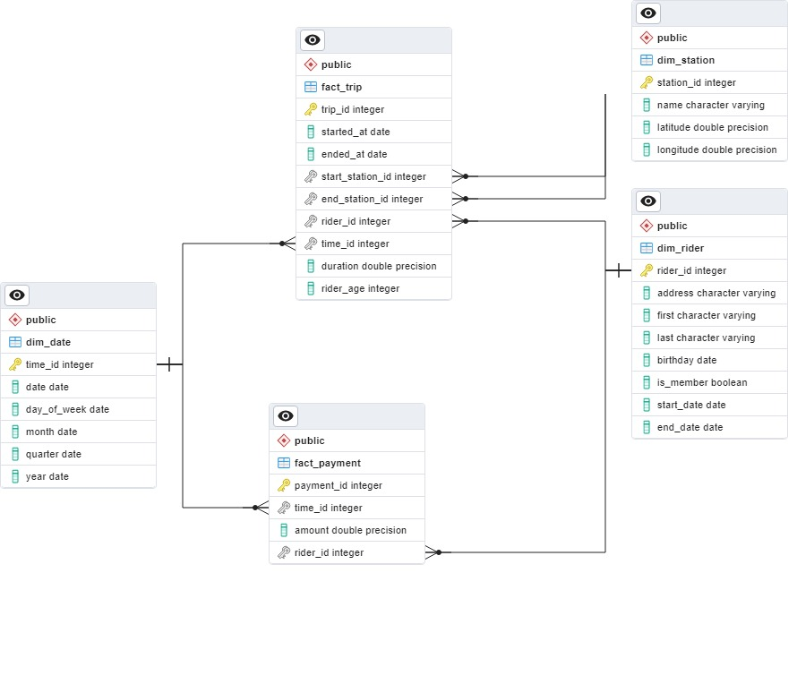

## Building-an-Azure-Data-Warehouse-for-Bike-Share-Data-Analytics

## Project Overview

Divvy is a bikesharing program in Chicago, Illinois USA that allows riders to purchase a pass at a kiosk or use a mobile application to unlock a bike at stations around the city and use the bike for a specified amount of time. The bikes can be returned to the same station or another station. The City of Chicago makes the anonymized bike trip data publicly available for projects like this where we can analyze the data. Since the data from Divvy are anonymous, we have created fake rider and account profiles along with fake payment data to go along with the data from Divvy.

### The goal of this project is to develop a data warehouse solution using Azure Synapse Analytics and more specifically to:

- Design a star schema based on the business outcomes listed below;
- Import the data into Synapse;
- Transform the data into the star schema;
- View the reports from Analytics.

### The business outcomes we are designing for are as follows:

1. Analyze how much time is spent per ride
- Based on date and time factors such as day of week and time of day
- Based on which station is the starting and/or ending station
- Based on the age of the rider at the time of the ride
- Based on whether the rider is a member or a casual rider
2. Analyze how much money is spent
- Per month, quarter, year
- Per member, based on the age of the rider at the account start
3. Analyze how much money is spent per member
- Based on how many rides the rider averages per month
- Based on how many minutes the rider spends on a bike per month

### Tasks:

#### Task 1: Create your Azure resources

- Create an Azure PostgreSQL database
- Create an Azure Synapse workspace. Note that if you've previously created a Synapse Workspace, you do not need to create a second one specifically for the project.
- Use the built-in serverless SQL pool and database within the Synapse workspace

#### Task 2: Design a star schema

##### Dataset

The dataset looks like this:

The Star schema looks like:

#### Task 3: Create the data in PostgreSQL

- Download the script file and place it in a folder where you can run a Python script
- Download the data files from the classroom resources or [this link](https://video.udacity-data.com/topher/2022/March/622a5fc6_azure-data-warehouse-projectdatafiles/azure-data-warehouse-projectdatafiles.zip)
- Open the script file in VS Code and add the host, username, and password information for your PostgreSQL database
- Run the script and verify that all four data files are copied/uploaded into PostgreSQL
You can verify this data exists by using pgAdmin or a similar PostgreSQL data tool.

#### Task 4: EXTRACT the data from PostgreSQL

In your Azure Synapse workspace, you will use the ingest wizard to create a one-time pipeline that ingests the data from PostgreSQL into Azure Blob Storage. This will result in all four tables being represented as text files in Blob Storage, ready for loading into the data warehouse.

Verify ingesting the data from PostgreSQL:

#### Task 5: LOAD the data into external tables in the data warehouse

Once in Blob storage, the files will be shown in the data lake node in the Synapse Workspace. From here, you can use the script-generating function to load the data from blob storage into external staging tables in the data warehouse you created using the serverless SQL Pool.

#### Task 6: TRANSFORM the data to the star schema

You will write SQL scripts to transform the data from the staging tables to the final star schema you designed.

